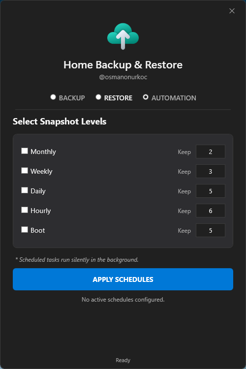

# 📂 Home Backup & Restore Utility (v11.7)

A lightweight, powerful, and intelligent backup tool for Windows, written entirely in PowerShell with a modern WPF GUI. It features **"Time Machine" style incremental backups** using NTFS Hard Links to save disk space while keeping every backup snapshot fully accessible.

**Now features advanced Automation & Retention policies (Timeshift style).**

[](https://github.com/osmanonurkoc/Rsync_Home_Backup_Restore/releases/latest)


## 📸 Screenshots

<p align="center">
  
  
  <br/>

  
  
  <br/>

  
  
</p>

*A smart, incremental backup utility for Windows built with PowerShell & WPF. Features NTFS hard-linking for storage efficiency, auto-dark mode, and a modern GUI.*

## ✨ Key Features (v12.0)

* **🤖 Smart Automation (Timeshift Style):** Set it and forget it. Configure retention levels for **Hourly, Daily, Weekly, Monthly, and Boot** backups. The tool automatically rotates snapshots, deleting the oldest one of that specific type before creating a new one.
* **📅 Task Scheduler Integration:** Automatically creates, updates, or removes Windows Scheduled Tasks directly from the GUI. No manual configuration needed.
* **🚀 Smart Incremental Backups (Turbo Mode):** Uses NTFS Hard Links. If a file hasn't changed since the last backup, it links to the old file instead of duplicating it. This saves massive amounts of disk space.
* **💻 Headless / CLI Support:** Run backups silently in the background using command-line arguments. Ideal for custom scripts or system admins.
* **🛑 Shutdown Prevention:** During a background backup, the tool temporarily blocks Windows Shutdown/Restart to prevent data corruption, ensuring the snapshot finishes safely.
* **⚡ Differential Restore:** Checks if the destination file is already identical (same size/time) to the backup. If so, it skips the copy, speeding up restoration.
* **🛡️ Safe Mirroring (Context-Aware Clean):** Removes extraneous files *only* within the specific sub-directories being restored. Guarantees that unrelated files in the parent directory are never touched.
* **👻 Ghost Folder Cleanup:** Automatically detects and forcibly removes stubborn empty folders locked by Windows system attributes.
* **🎨 Modern UI & Theme Engine:** Automatically detects your Windows theme (Light/Dark mode) and adjusts the interface in real-time.
* **💾 Persistent Settings:** Remembers your selected source folders and retention policies between sessions.

## 🚀 Getting Started

### Prerequisites
* **OS:** Windows 10 or Windows 11.
* **File System:** The backup destination drive **must be formatted as NTFS** to support Hard Links.
* **Privileges:** Administrator rights are required to configure Scheduled Tasks.

### Installation & Usage

#### Option 1: Using the Executable (Recommended)
1. Download the latest `HomeBackup.exe` from the **[Releases Page](https://github.com/osmanonurkoc/HomeBackup/releases/latest)**.
2. Place it in a folder (e.g., `C:\Tools\HomeBackup`).
3. Double-click `HomeBackup.exe` to run.

#### Option 2: Running the Script
1. Download `HomeBackup.ps1`.
2. Right-click and select **Run with PowerShell**.

---

## 🤖 Automation & CLI

### GUI Automation
Go to the **AUTOMATION** tab in the app.
1. Check the boxes for the intervals you want (e.g., **Daily** and **Weekly**).
2. Set how many snapshots to keep for each type (e.g., Keep 5 Daily, Keep 2 Monthly).
3. Click **APPLY SCHEDULES**.
   * *The tool will register the tasks in Windows Task Scheduler.*
   * *Snapshots created by automation will have suffixes like `_2024-02-01_12-00-Daily`.*
   * *Retention policy only deletes snapshots of its own type (e.g., a Daily backup trigger will never delete a Monthly snapshot).*

### Command Line Interface (CLI)
You can trigger backups manually via terminal or your own scripts:

```powershell
# Run a silent backup (uses Manual settings)
.\HomeBackup.exe -Silent

# Run a specific type (Applies 'Daily' retention policy)
.\HomeBackup.exe -Silent -BackupMode Daily

# Run a Monthly backup
.\HomeBackup.exe -Silent -BackupMode Monthly
**Supported Modes:** `Manual`, `Hourly`, `Daily`, `Weekly`, `Monthly`, `Boot`.
```
----------

## ⚙️ Configuration (Exclusions)

You can customize exactly what gets skipped by editing the `exclude_list.json` file.

**Example `exclude_list.json`:**

JSON

```
{
  "GlobalExtensions": [".tmp", ".log", ".bak", ".dmp", ".vdi", ".vmdk"],
  "GlobalFolders": ["node_modules", "bin", "obj", ".git", ".vs", "AppData", "cache"],
  "IgnoredSystemFolders": ["$RECYCLE.BIN", "System Volume Information", "OneDriveTemp"],
  "FolderSpecific": {
    "Downloads": [".exe", ".msi"],
    "Videos": [".srt"]
  }
}

```

## ⚠️ Disclaimer

This script is provided "as is". **Use at your own risk.** The author is not responsible for any data loss. Always test the script in a safe environment first.

## 📄 License

This project is licensed under the [MIT License](LICENSE).

----------

_Created by [@osmanonurkoc](https://github.com/osmanonurkoc)_
